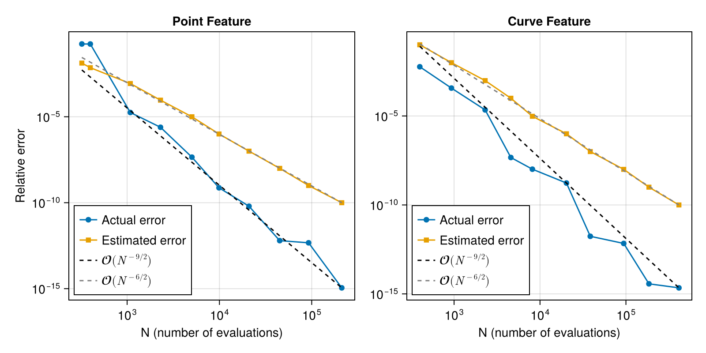
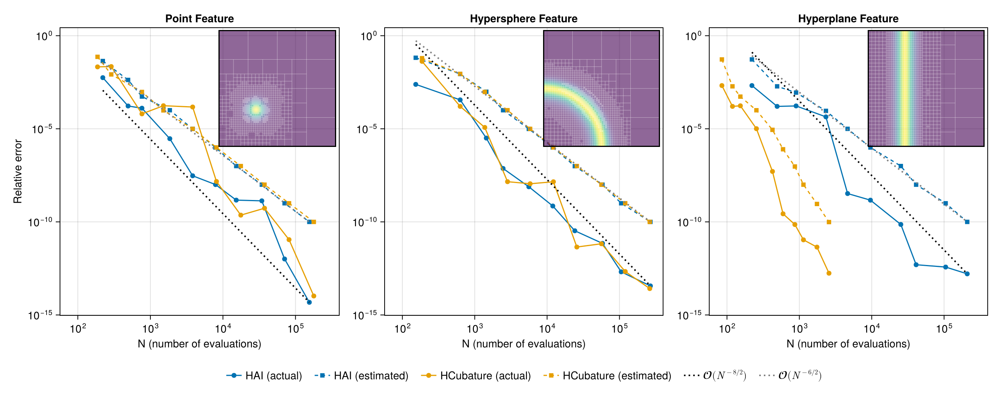

# Summary

`HAdaptiveIntegration.jl` is a `Julia` [@Julia] package for automatic adaptive numerical integration on multidimensional simplices and axis-aligned orthotopes.
It approximates integrals of the form
$$
  I = \int_{\Omega} f(\boldsymbol{x}) \, \operatorname{d}\!\boldsymbol{x}
$$
where $f \colon \mathbb{R}^d \to \mathbb{T}$ maps to any type $\mathbb{T}$ forming a normed real vector space (*e.g.* $\mathbb{T} = \mathbb{R},\ \mathbb{C},\ \mathbb{R}^n$), and $\Omega \subset \mathbb{R}^d$ is a simplex (triangles, tetrahedra, etc.) or axis-aligned orthotope (rectangle, cuboid, etc.).
where $f \colon \mathbb{R}^d \to \mathbb{T}$ takes values in a normed real vector space (*e.g.* $\mathbb{T} = \mathbb{R},\ \mathbb{C},\ \mathbb{R}^n$), and $\Omega \subset \mathbb{R}^d$ is a simplex (triangles, tetrahedra, etc.) or axis-aligned orthotope (rectangle, cuboid, etc.).
`HAdaptiveIntegration` combines uniform subdivision with embedded cubature to return both an integral estimate and an a posteriori error estimate.

Its main features are:

- Adaptive integration over simplices and orthotopes of arbitrary dimension;
- Efficient tabulated cubature rules for low-dimensional domains;
- Support for user-defined cubature rules and subdivision strategies;
- Arbitrary-precision arithmetic.

## Usage

The package is centered on a single function, `integrate(f, domain; kwargs...)`, together with constructors for common domains.
The workflow has two steps:

**Create a domain** using `Simplex` (defined by its vertices) or `Orthotope` (defined by its low and high corner), with aliases `Segment`, `Triangle`, `Tetrahedron`, `Rectangle`, `Cuboid`.

```julia
using HAdaptiveIntegration
segment     = Segment(0, 1)
triangle    = Triangle((0,0), (1,0), (0,1))
rectangle   = Rectangle((0,0), (1,1))
simplex4    = Simplex((0,0,0,0), (1,0,0,0), (0,1,0,0), (0,0,1,0), (0,0,0,1))
```

**Integrate** using the same interface for both domain types:

```julia
f(x) = cis(sum(x)) / (sum(abs2, x) + 1e-2)
I, E = integrate(f, triangle)
I, E = integrate(f, rectangle)
```

The function returns a pair `(I, E)`, where `I` is the integral estimate and `E` is its a posteriori error estimate. Key stopping-condition keywords are `atol`, `rtol`, and `maxsubdiv`.

# Statement of need

Adaptive numerical integration is a fundamental building block in scientific computing, including finite-element and boundary-element methods and parameter studies over reference or physical cells.
To our knowledge, no `Julia` package supported adaptive integration on simplices before this work.
`HAdaptiveIntegration` fills this gap while also providing specialized tabulated rules for higher-order accuracy, a single unified interface for both simplices and orthotopes, user-extensible cubature, and optional arbitrary-precision arithmetic.

# State of the field

`HAdaptiveIntegration` is complementary to the existing `Julia` ecosystem.
`QuadGK.jl` [@QuadGK] remains the right choice in one dimension.
`HCubature.jl` [@HCubature] is often preferable for medium- to high-dimensional orthotopes, where its estimator-driven axis-aligned bisection outperforms uniform subdivision when the integrand varies primarily along one direction.
`Cuba.jl` [@Cuba] is better suited for high-dimensional problems where stochastic methods dominate.
The distinct contribution of `HAdaptiveIntegration` is support for simplices of arbitrary dimension together with orthotopes under one API, with efficient tabulated rules in low dimensions. This combination is not provided by the packages above.

# Software design

`HAdaptiveIntegration` has two submodules: `Domain`, which defines integration domains and their subdivision; and `Rule`, which defines integration rules (either computed from explicit formulas or tabulated in decimal format).
Its single entry point is `integrate`, whose adaptive algorithm combines embedded cubature with a subdivision strategy.

## Embedded cubature

At the core of an adaptive numerical integration method is a cubature pair $(\mathcal{H}, \mathcal{L})$, defined on the reference domain $\widehat{\omega}$ (equal to $\{\boldsymbol{x} \in \mathbb{R}_+^d \mid x_1 + \cdots + x_d \leq 1\}$ for simplices or $[0, 1]^d$ for orthotopes) by
$$
  \mathcal{H}(f) = \sum_{1 \leq i \leq \mathsf{H}} h_i \, f(\boldsymbol{x}_i)
  \quad \text{and} \quad
  \mathcal{L}(f) = \sum_{1 \leq i \leq \mathsf{L}} \ell_i \, f(\boldsymbol{x}_i),
  \qquad \forall f \in \mathscr{C}^0(\widehat{\omega}).
$$
where $\boldsymbol{x}_1, \ldots, \boldsymbol{x}_{\mathsf{H}} \in \widehat{\omega}$ are the cubature points, $h_i$ the $\mathcal{H}$ weights, $\ell_i$ the $\mathcal{L}$ weights, and $\mathsf{H} > \mathsf{L}$.
The $\mathcal{L}$ rule uses a subset of the $\mathcal{H}$ points (hence *embedded*), and the two rules have polynomial exactness orders $k_h > k_\ell$, where the order is the highest degree $k$ for which the rule integrates all polynomials exactly.

For a domain $\omega$ with reference map $\phi \colon \widehat{\omega} \to \omega$, the *local* estimated integral value $I_\omega$ and error $E_\omega$ are
$$
  I_\omega = \lvert\det \operatorname{J}_\phi\rvert \ \mathcal{H}(f \circ \phi)
  \quad \text{and} \quad
  E_\omega = \lvert\det \operatorname{J}_\phi\rvert \ \lVert \mathcal{H}(f \circ \phi) - \mathcal{L}(f \circ \phi) \rVert,
$$
where $\operatorname{J}_\phi$ is the Jacobian of $\phi$ (which is constant for simplices and axis-aligned orthotopes) and $\lVert \cdot \rVert$ is the chosen norm on $\mathbb{T}$.

Each domain type has a default embedded cubature summarized in \autoref{tbl:default-rule}.

|                                           |                                 |
| :---------------------------------------- | :------------------------------ |
| 1d. `Segment` [@Laurie1997]               |                                 |
| 2d. `Triangle` [@Laurie1982]              | `Rectangle` [@GenzMalik1980]    |
| 3d. `Tetrahedron` [@GrundmannMoeller1978] | `Cuboid` [@BerntsenEspelid1988] |
| $n$d. `Simplex` [@GrundmannMoeller1978]   | `Orthotope` [@GenzMalik1980]    |
: Default embedded cubature rules by domain.\label{tbl:default-rule}

## The adaptive algorithm

Given a function $f$ and an initial domain $\Omega$, the adaptive algorithm constructs a sequence of nested partitions.
It starts with $\mathcal{P}_0 = \{\Omega\}$ and iterates by
$$
  \mathcal{P}_{n+1} = \left[ \mathcal{P}_n \setminus \left\{\omega^*\right\} \right] \cup \left\{\omega^*_1, \ldots, \omega^*_{2^d}\right \},
  \qquad \forall n \in \mathbb{N},
$$
where $\omega^*$ is chosen such that $E_{\omega^*} = \max \{E_\omega : \omega \in \mathcal{P}_n\}$, and $\omega^*_1, \ldots, \omega^*_{2^d}$ are subdomains given by a subdivision of $\omega^*$.
In dimension $d$, orthotopes are bisected along each axis and simplices by midpoint edge refinement [@SimplexSubdiv], both producing $2^d$ subdomains.

For the sequence ${(\mathcal{P}_n)}_{n \in \mathbb{N}}$, we define the global integral value $I_n$ and error $E_n$ estimators by
$$
  I_n = \sum_{\omega \in \mathcal{P}_n} I_\omega
  \quad \text{and} \quad
  E_n = \sum_{\omega \in \mathcal{P}_n} E_\omega.
$$
For this type of algorithm, the stopping condition is controlled by three parameters: the absolute tolerance $\mathtt{atol} \geq 0$, the relative tolerance $\mathtt{rtol} \geq 0$, and the maximum number of subdivisions $n_{\max} \in \mathbb{N}$.
The subdivision process stops when
$$
  E_n \leq \mathtt{atol}
  \quad \text{or} \quad
  E_n \leq \mathtt{rtol}\, \lVert I_n \rVert
  \quad \text{or} \quad
  n = n_{\max}.
$$
At the end, $(I_n, E_n)$ is returned as the integral value and error estimate.

## Implementation

The implementation uses a max binary heap from [DataStructures.jl](https://github.com/JuliaCollections/DataStructures.jl) to store $\{(\omega, I_\omega, E_\omega) : \omega \in \mathcal{P}_n \}$, ordered by $E_\omega$, for efficient retrieval of the maximum local error.
When computing multiple integrals of the same type, the heap can be pre-allocated and passed via the `buffer` keyword to reduce allocations.

## Extended precision

As noted above, `integrate` supports arbitrary precision.
Only the rules from [@GrundmannMoeller1978; @GenzMalik1980] are generated from explicit formulas; the others are tabulated at quadruple precision and are therefore incompatible with arbitrary precision.
`HAdaptiveIntegration` addresses this with the optional `IncreasePrecisionExt` extension, which refines a tabulated rule by solving the polynomial exactness conditions with Newton iterations and automatic differentiation through `ForwardDiff.jl` [@ForwardDiff2016].

More precisely, let $\widehat{\omega}$ be a reference domain and $(\mathcal{H}, \mathcal{L})$ be an embedded cubature on $\widehat{\omega}$ with orders $k_h > k_\ell$.
Let $b_1, \ldots, b_{K_h}$ be a basis of $\mathbb{P}_{k_h}$ (polynomials of total degree $\leq k_h$) such that $b_1, \ldots, b_{K_\ell}$ is a basis of $\mathbb{P}_{k_\ell}$.
Define $\boldsymbol{u}^{\mathcal{H}, \mathcal{L}} = (\boldsymbol{x}_1, \ldots, \boldsymbol{x}_{\mathsf{H}}, h_1, \ldots, h_{\mathsf{H}}, \ell_1, \ldots, \ell_{\mathsf{L}})$ as the embedded cubature data, and the function $F \colon \mathbb{R}^{(d+1) \mathsf{H} + \mathsf{L}} \to \mathbb{R}^{K_h + K_\ell}$ by
$$
  F\left( \boldsymbol{u}^{\mathcal{H}, \mathcal{L}} \right) =
  \begin{pmatrix}
    \mathcal{H}(b_1) - \int_{\widehat{\Omega}} b_1(\boldsymbol{x}) \operatorname{d}\!\boldsymbol{x}
    \\[1ex]
    \vdots
    \\[1ex]
    \mathcal{H}(b_{K_h}) - \int_{\widehat{\Omega}} b_{K_h}(\boldsymbol{x}) \operatorname{d}\!\boldsymbol{x}
    \\[2ex]
    \mathcal{L}(b_1) - \int_{\widehat{\Omega}} b_1(\boldsymbol{x}) \operatorname{d}\!\boldsymbol{x}
    \\[1ex]
    \vdots
    \\[1ex]
    \mathcal{L}(b_{K_\ell}) - \int_{\widehat{\Omega}} b_{K_\ell}(\boldsymbol{x}) \operatorname{d}\!\boldsymbol{x}
  \end{pmatrix}.
$$
Starting from a tabulated rule with $\lVert F(\boldsymbol{u}^{\mathcal{H}, \mathcal{L}}) \rVert_2 = \varepsilon \ll 1$, we seek $\tilde{\boldsymbol{u}}$ with $\lVert F(\tilde{\boldsymbol{u}}) \rVert_2 = \eta < \varepsilon$ via a least-squares Newton method [@XiaoGimbutas2010, section 2.3].
Setting $\boldsymbol{u}_0 = \boldsymbol{u}^{\mathcal{H}, \mathcal{L}}$, the iteration is
$$
  \boldsymbol{u}_{p+1} = \boldsymbol{u}_p - \boldsymbol{\delta}_p
  \qquad \text{where} \
  \boldsymbol{\delta}_p = \arg\min \left\{ \lVert \boldsymbol{w} \rVert_2 \mid \operatorname{J}_F(\boldsymbol{u}_p) \boldsymbol{w} = F(\boldsymbol{u}_p) \right\},\tag{N}
$$
and $\operatorname{J}_F(\boldsymbol{u}_p)$ is the Jacobian matrix of $F$ at the point $\boldsymbol{u}_p$.
The iteration stops when $\lVert \boldsymbol{u}_{p+1} - \boldsymbol{u}_p \rVert_2 \leq \mathtt{x\_atol}$ (absolute tolerance of successive iterates) or $\lVert F(\boldsymbol{u}_p) \rVert_2 \leq \mathtt{f\_atol}$ (absolute tolerance of function value) or $p = p_{\max}$ (maximum number of iterations).

**Remark.** The system in (N) is solved by least squares ("`\`" in `Julia`) because $K_h + K_\ell < (d+1) \mathsf{H} + \mathsf{L}$ makes $\operatorname{J}_F(\boldsymbol{u}_p)$ a wide rectangular matrix; the minimum-norm solution is selected.

**Remark.** The monomial basis is convenient but poorly conditioned, so achieving precision $\varepsilon$ requires `BigFloat` arithmetic at a higher internal precision $\eta < \varepsilon$; an $\mathrm{L}^2$-orthogonal basis would improve conditioning.

**Remark.** Symmetry is not enforced in the Newton iteration; a rule refined from precision $\varepsilon$ to $\eta < \varepsilon$ therefore retains its symmetry only up to $\varepsilon$.

# Research impact statement

The repository includes API documentation, examples (buffer pre-allocation, `callback` mechanism, custom cubature, arbitrary-precision workflows), an automated test suite, and continuous integration covering tests, documentation, and linting.
`HAdaptiveIntegration` has been featured in the [Julia world newsletter](https://discourse.julialang.org/t/this-month-in-julia-world-2026-02/136110), interfaced in [Integrals.jl](https://github.com/SciML/Integrals.jl) (SciML ecosystem), used as a backend in [@Inti], and adopted as a dependency of [`Meshes.jl`](https://github.com/JuliaGeometry/Meshes.jl/releases/tag/v0.57.0).

# Example gallery

We showcase the package on integrands with localized features constructed from the mollified integrand
$$
  \delta_\epsilon(\phi(\boldsymbol{x})) = \frac{1}{\varepsilon^c} \eta \left(\frac{\phi(\boldsymbol{x})}{\varepsilon}\right),
  \qquad \eta(r) = \frac{1}{\sqrt{2\pi}} e^{-r^2/2},
$$
where $\phi$ is a level-set function vanishing on the feature $\Gamma = \phi^{-1}(0)$ and $c$ is the codimension of $\Gamma$ (so the total mass stays $\mathcal{O}(1)$ as $\varepsilon \to 0$).
We consider three canonical geometries:

- **Point:** $\phi(\boldsymbol{x}) = \lVert\boldsymbol{x} - \boldsymbol{x}_0\rVert_2$, codimension $c = d$;
- **Hypersphere:** $\phi(\boldsymbol{x}) = \lVert\boldsymbol{x}\rVert_2^2 - r^2$, codimension $c = 1$;
- **Hyperplane:** $\phi(\boldsymbol{x}) = x_1 - x_*$, codimension $c = 1$.

We set $\boldsymbol{x}_0 = \tfrac{1}{\pi}(1, \ldots, 1)$, $r = 1/2$, and $x_* = 1/\pi$ so that the features are well contained in the domain.
The hyperplane is axis-aligned, making it a useful benchmark for comparing uniform versus estimator-driven subdivision.
Convergence plots sweep $\mathtt{rtol} = 10^{-i}$ ($i = 1, \ldots, 10$; up to $8$ in 3D), recording total evaluations $N$, the returned error estimate, and the actual error against a reference at $\mathtt{rtol} = 10^{-12}$.

## Simplices

\autoref{fig:cvg_simplex} shows convergence on the unit triangle ($d=2$, Radon-Laurie rule [@Laurie1982]) and tetrahedron ($d=3$, Grundmann-Möller rule [@GrundmannMoeller1978], available for arbitrary dimension).
Two observations hold across all features and both cases: the estimated error reliably tracks the actual error, confirming a sound a posteriori indicator; and once the feature is resolved, errors follow $\mathcal{O}(N^{-(k+1)/d})$ with $k = k_h$ or $k_\ell$ and the exponent from $N \propto h^{-d}$.




## Orthotopes and comparison with `HCubature.jl`

\autoref{fig:cvg_orthotope} compares `HAdaptiveIntegration` against `HCubature.jl` on the unit square and cube.
In 2D both use the Genz-Malik rule [@GenzMalik1980], isolating the subdivision strategy; in 3D the cubature rules also differ (Berntsen-Espelid [@BerntsenEspelid1988] for `HAdaptiveIntegration`).
For the point and hypersphere features the solvers are comparable in both dimensions.
For the hyperplane, `HCubature.jl` has a clear advantage because its estimator refines exclusively along $x_1$ rather than bisecting uniformly in all $d$ directions, and this gap grows with $d$, motivating anisotropic splitting as future work.




# AI usage disclosure

Generative AI was used for developing the code and to help draft and edit parts of this manuscript.
All text produced with AI assistance was reviewed, revised, and verified by the authors before inclusion in the code or paper.

# References
